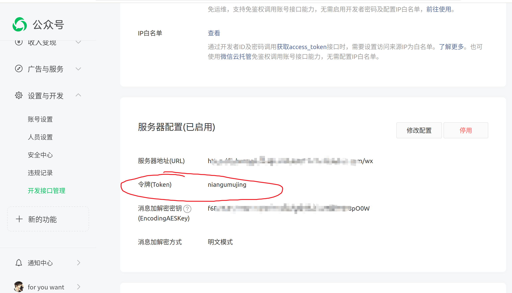
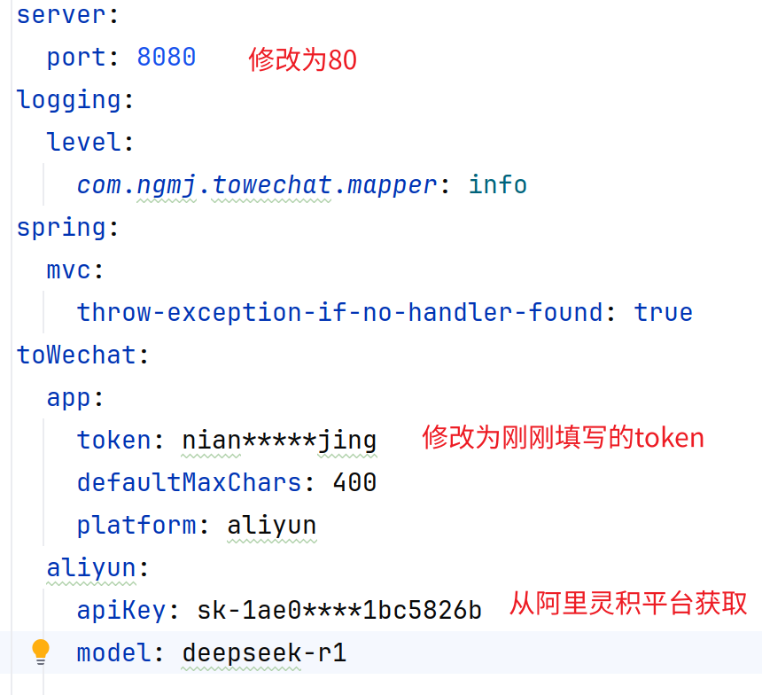
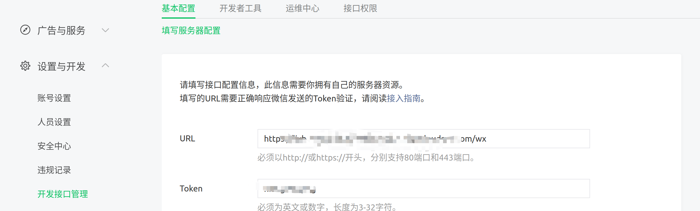

ai接入个人微信公众号

目前只支持阿里灵积平台deepseek

1，创建一个公众号，注册教程：
https://zhuanlan.zhihu.com/p/25140448064

2.获取配置，只需要自己填写的token



3.复制resources目录下application.yml



阿里灵积链接：
https://bailian.console.aliyun.com/?tab=model#/api-key
创建一个apikey 填写

使用jdk17 运行towechat-1.0-SNAPSHOT.jar文件
java -jar towechat-1.0-SNAPSHOT.jar --spring.config.name=application

在微信公众平台填写服务器配置

url填写：
http：//服务器ip地址:80/wx
个人电脑可用内网穿透

4.运行成功后，在微信中搜索公众号，发送消息即可

docker部署
```
docker run --name towechat -p 8080:8080 -e TO_WECHAT_APP_TOKEN=token -e TO_WECHAT_ALIYUN_API_KEY=阿里灵积平台apikey -e TO_WECHAT_ALIYUN_API_SECRET=阿里灵积平台apisecret -d  crpi-3ehjzzneqvumxsnz.cn-hangzhou.personal.cr.aliyuncs.com/naingumujing/towechat
```